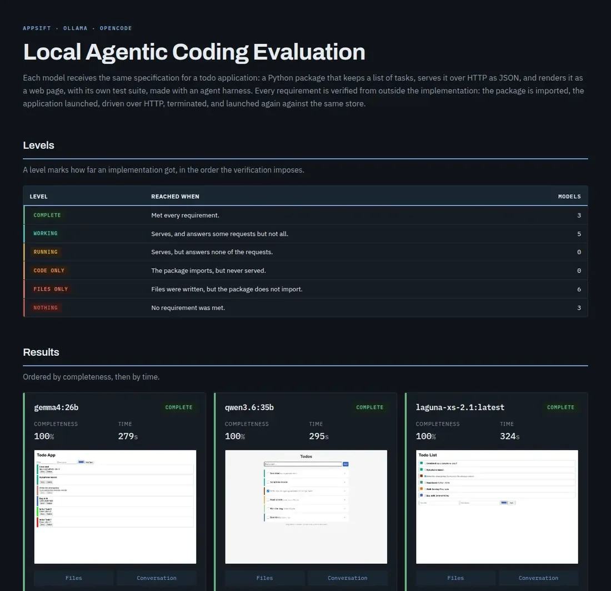

# llm-appsift

llm-appsift asks whether a locally hosted model can create a working application from a written
specification, using an agent harness with real tool access rather than a single prompt. Every
model receives the same specification, for a todo application, and every requirement is
verified from outside the implementation.



Model-written code is executed without a sandbox. It runs with the privileges of the invoking
user and with unrestricted access to the filesystem and the network, and can therefore damage the
host system. Running the harness inside a virtual machine is strongly recommended.

## Requirements

- Python 3.9 or newer
- A reachable Ollama server, with the models to be evaluated already installed
- [opencode](https://opencode.ai) on `PATH`; each model is declared to it for the run, so
  nothing needs to be added to its own configuration first
- Flask and pytest importable, since models are told to install nothing
- A headless Chromium, used for the screenshot and to judge the rendered page; without one the
  page is judged on its source

## Installation

Linux and macOS:

```bash
python3 -m venv .venv
source .venv/bin/activate
pip install .
```

Windows:

```bash
python -m venv .venv
.venv\Scripts\activate
pip install .
```

## Quick Start

```bash
appsift --models-file models.txt -o report.html
```

Without `--models` or `--models-file`, every model installed on the server is evaluated. Results
are recorded as they are measured, so an interrupted sweep is resumed by running the same command
again, and a later run against a new model adds to the same data rather than starting over.
`appsift --help` lists the remaining options.

```bash
appsift --spec
```

Prints the specification the models are given, without running anything.

Progress is written as [TAP version 14](https://testanything.org/tap-version-14-specification.html).
